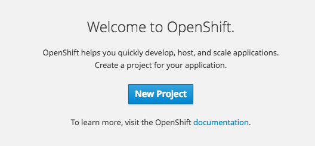
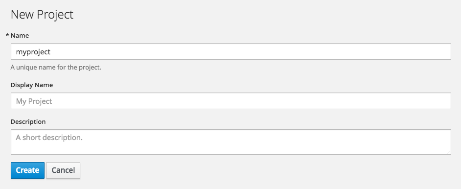

The easiest way to access and interact with OpenShift is through the web console. The URL for the web console will be dictated by what was specified as the public URL for the OpenShift cluster when it was set up. Once the web console is accessed, how you then login will depend on the configured identity provider.

For this course the public URL for the web console is:

**https://[[HOST_SUBDOMAIN]]-8443-[[KATACODA_HOST]].environments.katacoda.com**

To view the web console at the same time as these instructions, you can also select the _Dashboard_ tab to the right of the embedded _Terminal_.

In the case of the OpenShift cluster managing user authentication, the web console login page will prompt you for your _Username_ and _Password_.

In the case of an external authentication service provider being used as the identity provider, it will be necessary to login first to the external service. As an example, if you were signed up for the [OpenShift Online developer preview](https://www.openshift.com/devpreview/) you would be asked to login via GitHub.

For the OpenShift cluster used in this course, as the OpenShift cluster is managing user authentication, you will be presented with a login page that prompts you for your user account credentials. You can login using the credentials:

* **Username:** ``developer``
* **Password:** ``developer``

As this is the first time you have logged in as this user in this OpenShift cluster, you will be presented with a "Welcome to OpenShift" message and the option of creating a new project.

Create a new project by selecting _New Project_. Call the project ``myproject``.

When a new project is created you will be shown a catalog of application types you can deploy. To skip creating any application at this point and get to the list of all projects you have, you can select on the name of the OpenShift product found at the top left of the page.

This is useful if you ever got lost in the web console and want to get back to the top most level.

