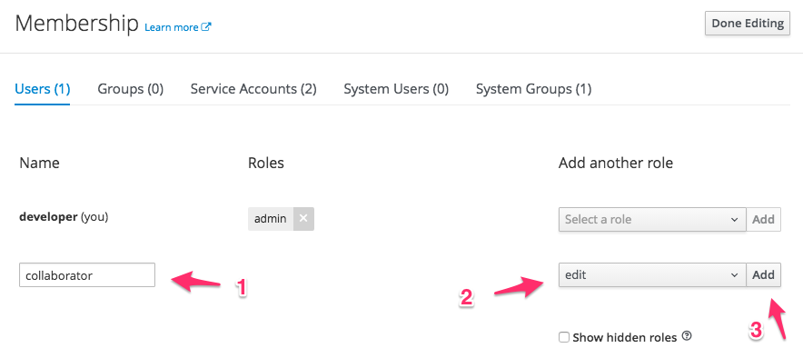

Working alone can be lots of fun, but as your application grows you may want to get others to help. This is no problem with OpenShift as it is built to be multi tenant. This means it can support many different users, each working on their own applications. To support collaboration on the same project, you can also grant other users access to any of your projects. Access can be granted at varying levels depending on what they need to be able to do in your project.

To test out how users can collaborate, we need another user.

Login from the command line as a new user called ``collaborator`` by running:

``oc login --username collaborator --password collaborator``{{execute}}

This is the first time this user has logged in, so if you run:

``oc get projects``{{execute}}

you should see that he has access to no projects.

To grant this user access to your project, go to the list of projects in the web console and select on the people icon to view project membership.

You will see that only the ``developer`` user is a member of the project. Select _Edit Membership_.

Next enter ``collaborator`` as the name of a new member for the project and select _edit_ from the list of roles. Click on _Add_ to create the new role for the user.

The user ``collaborator`` is now a member of the project. Back in the _Terminal_ run again the command:

``oc get projects``{{execute}}

This should show that ``collaborator`` now has access to the project created by the ``developer`` user.

In this case you gave ``collaborator`` the role type ``edit`` in the project. This allows the user to perform most tasks within the project, with the exception of tasks related to administration of the project. The user therefore cannot make changes to project membership or delete the project.

Other roles you might instead assign to a collaborator are ``view``, which means they can look at everything in the project, but not change anything, or ``admin``, which gives them equal rights as the owner of the project, including editing project membership or deleting the project.

Making changes to project membership can also be done from the command line using ``oc``.

As ``collaborator`` has no projects at this point, create one by running:

``oc new-project mysecrets``{{execute}}

Then add the ability for ``developer`` to also view that project by running:

``oc adm policy add-role-to-user view developer -n mysecrets``{{execute}}

The list of projects in the web console should now show both projects.
