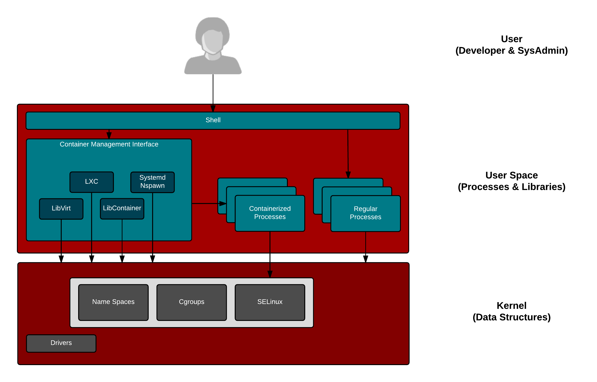

It is possible to leverage our existing architectural knowledge in a containerized environent. To do this, we need to understand some fundamental primatives including: libraries, containerized processes, regular processes, kernel data structures (namespaces, cgroups, SELinux).




old material
=============================================================


Before we get started, you need to login and create a project in OpenShift
to work in.

To login to the OpenShift cluster used for this course from the _Terminal_,
run:

``oc login -u developer -p developer``{{execute}}

This will log you in using the credentials:

* **Username:** ``developer``
* **Password:** ``developer``

You should see the output:

```
Login successful.

You don't have any projects. You can try to create a new project, by running

    oc new-project <projectname>
```

To create a new project called ``myproject`` run the command:

``oc new-project myproject``{{execute}}

You should see output similar to:

```
Now using project "myproject" on server "https://172.17.0.41:8443".

You can add applications to this project with the 'new-app' command. For example, try:

    oc new-app centos/ruby-22-centos7~https://github.com/openshift/ruby-ex.git

to build a new example application in Ruby.
```

Switch to the _Dashboard_ and login to the OpenShift web console using the
same credentials you used above.


This should leave you at the list of projects you have access to. As we only
created the one project, all you should see is ``myproject``.


Click on ``myproject`` and you should be left at the _Overview_ page for
the project.


As the project is currently empty, you should be presented with an _Add to Project_
button.
