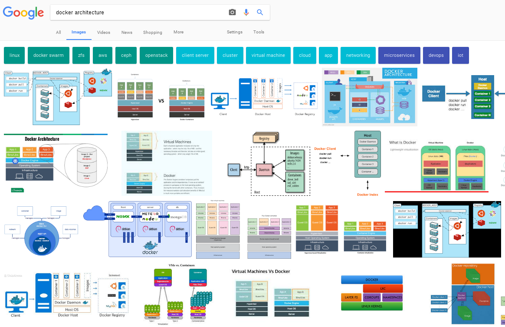

First and foremost, you need to understand that THE INTERNET IS WRONG. If you just do a quick Google search, you will find architectural drawing after architectural drawing which depict things the wrong way or depict only part of the whole picture, rendering the viewer to come to the wrong conclusion about containers. One might suspect that the makers of many of these drawings have the wrong conclusion about how containers work. So, forget everything you think you know.

What’s wrong? Two main things:
 
1. Most of the architectural drawings above show the docker daemon as a wide blue box stretched out over the container host. The containers are shown as if they are running on top of the docker daemon. This is incorrect - the containers are actually created and run by the Linux kernel.
2. When the architectural drawings do actually show the right architecture between the docker daemon, libcontainer/lxc/etc and the kernel, they never show containers running side by side. This leaves the viewer to imagine #1.
 
OK, let’s start from scratch. In the terminal, let's start with a simple experiment - start three contianer which will all run the the top command:

``docker run -td rhel7 top``{{execute}}''

``docker run -td rhel7 top``{{execute}}''

``docker run -td rhel7 top``{{execute}}''

Now, let's inspect the process table of the underlying host:

``ps -ef | grep top``{{execute}}

Notice that even though we started each of the ``top`` commands in containers, they are still just a regular process which can be viewed with the trusty old ``ps`` command. That's because containers are just [fancy Linux processes](http://sdtimes.com/guest-view-containers-really-just-fancy-files-fancy-processes/) with extra isolation from normal Linux processes. 

Containerized processes are started in a way that their kernel data structures are separate from other Linux processes on the system and are further isolated using technologies like selinux and cgroups, but they are still just Linux processes. This is sometimes described as "sand boxing" or "isolation" or an "illusion" of virtualization.

In the end though, containerized processes are just regular Linux processes. All processes live side by side, whether they are  regular Linux processes, long lived daemons, batch jobs, interactive commands which you run manually, or containerized processes. All of these processe make requests to the Linux kernel for protected resources like memory, ram, tcp sockets, etc. We will explore this deeper in later labs, but for now, commit this to memory...
