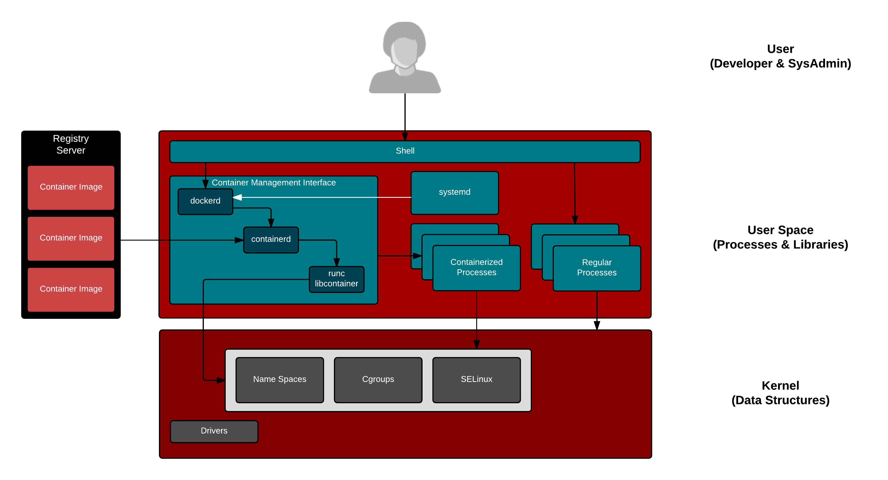

Now, let's inspect the daemons which are running on the master nodes. Normally, we would just use the ps command to dump the contents of the process id table in the linux kernel. For the purpose of clarity, we will use a simple script called mega-proc which will dump this same content, but pretty printed for clarity. Each of the command line options are displayed on a separate line for clarity. Lets inspect the pieces parts of the docker userspace toolchain.

``mega-proc.sh docker``{{execute}}

We call this a userspce toolchain because none of it lives in the kernel. The following proecesses and daemons are running in user space, not terribly different than bind or httpd. You may notice that all of the docker commands and daemons have the "-current" extension - this is a methodology Red Hat uses to specify which version of the tools are installed. Red Hat supports two versions - a fast moving version with the -latest extension and a stable version targetted for OpenShift with the -current extension.

These processes all work together to create a container in the Linux kernel. The following is a basic description of their purpose:

- **dockerd**: This is the main docker daemon. It handles all docker API calls (docker run, docker build, docker images) through either the unix socket /var/run/docker.sock or it can be configured to handle requests over TCP. This is the "main" daemon and it is started by systemd with the /usr/lib/systemd/system/docker.service unit file.
- **docker-containerd**: Containerd was recently open sourced as a separate community project. The docker daemon talks to containerd when it needs to fire up a container. More and more plumbing is being added to containerd (such as storage).
- **docker-containerd-shim**: this is a shim layer which starts the docker-runc-current command with the right options.
- **docker**: This is the docker command which you typed on the command line.
