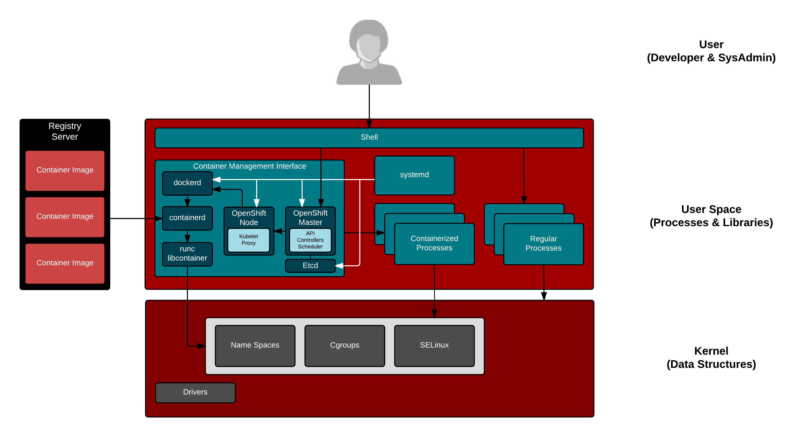

Now let's take a look at the OpenShift daemons which are runnning on the master. OpenShift masters are typically installed with the OpenShift node daemons running as well, so you will see several daemons running. Now let's take a look ourselves:

``mega-proc.sh openshift``{{execute}}''

Notice, again, that the openshift processes are just standard daemons running side by side with docker, containerd, the containerized processes and all of the other processes on the system:

The OpenShift/Kubernetes code is very modular. OpenShift compiles all of the functionality into a single binary and determines which role the daemon will play with startup parameters. Depending on which installation method (single node, clustered, registry server only, manual) is chosen the OpenShift binaries can be started in different ways.

In a full highly available, multi-master environment, you will see all of the following daemons running. On smaller installations, or all in one installation, several of these services may be running inside daemon configured to run as master:

- **openshift start master api**: This process handles all API calls with REST, kubectl, or oc commands.
- **/usr/bin/openshift start node**: This process plays the role of the Kubelet and communicates with dockerd (which then communicates with the kernel) to create containers.
- **/usr/bin/openshift start master controllers**: This daemon embeds the core control loops shipped with Kubernetes. A controller is a control loop that watches the shared state of the cluster through the apiserver and makes changes attempting to move the current state towards the desired state. Examples of controllers that ship with Kubernetes today are the replication controller, endpoints controller, namespace controller, and serviceaccounts controller.
