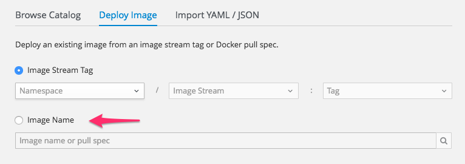
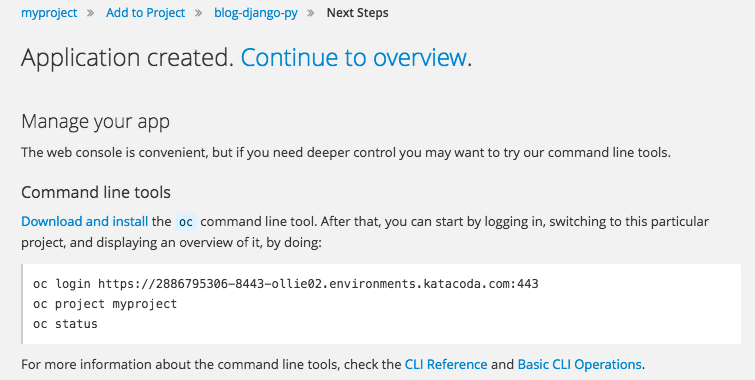

From within the project, to deploy an existing Docker-formatted container image select _Add to Project_.

When you are in an empty project, a prominent _Add to Project_ button will be displayed in the centre of the page.


If applications had previously been deployed to the project, or you were not on the project _Overview_ page, you can use the _Add to project_ link in the menu bar.


Clicking on either option, you should be presented with the catalog browser.


For deploying an application from an existing Docker-formatted container image, you need to switch to the _Deploy Image_ tab.



When deploying an application from an image, there are two choices.

The first choice is to select an image by specifying its _Image Stream Tag_. This option would be used where the image had previously been imported into the OpenShift cluster, or had been built within the OpenShift cluster from a ``Dockerfile`` or using Source-to-Image.

The second choice is to specify the _Image Name_, where the image resides on an external image registry. This can be the Docker Hub Registry, or any other accessible image registry.

For this example, the application image we are going to deploy is being hosted on the Docker Hub Registry. You should therefore select the _Image Name_ option.

In the _Image name or pull spec_ field enter:

```
openshiftkatacoda/blog-django-py
```

Press _Enter_, or click on the magnifying glass to the right of the field. This should trigger a query to pull down the details of the image from the Docker Hub Registry, including information on when the image was last updated, the size of the image and the number of layers.


From the name of the image, the _Name_ field will be automatically populated. This name is used in OpenShift to identify the resources created when the application is deployed. This will include the internal _Service_ name used by other applications in the same project to communicate with it, as well as being used as part of the default hostname for the application if exposed externally to the cluster via a _Route_.

In this example leave the _Name_ field as ``blog-django-py``. For your own application you would consider changing this name to something more appropriate.

When you are ready, at the bottom of the page click on _Create_. This will take you to a splash page confirming the application deployment is occurring.



Click on _Continue to overview_ and you will be returned to the _Overview_ page, where you can view the details of the application created and monitor progress as it is deployed. When deployment as finished you should see:

