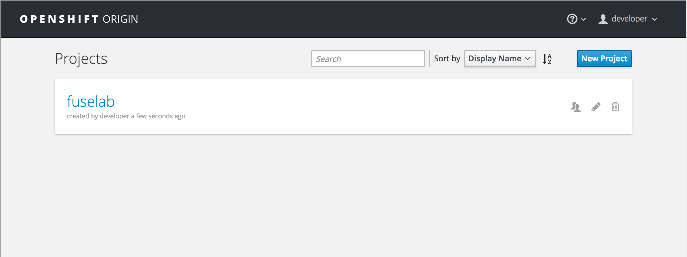
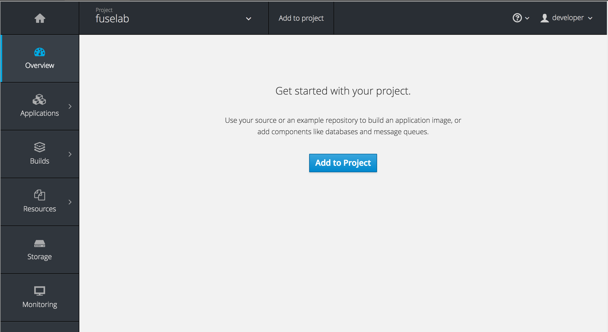

Test v2

To get started, first we need to login to OpenShift.

To login to the OpenShift cluster use the following commmand in your _Terminal_:

``oc login -u developer -p developer``{{execute}}

This will log you in using the credentials:

* **Username:** ``developer``
* **Password:** ``developer``

You should see the output:

```
Login successful.

Now we need to creae a Project space in OpenShift for our API.  In OpenShift we can create a new project by running

    oc new-project <projectname>
```

For out project lets create a project called ``fuselab`` by running the command:

``oc new-project fuselab``{{execute}}

You should see output similar to:

```
Now using project "fuselab" on server "https://172.17.0.41:8443".

You can add applications to this project with the 'new-app' command. For example, try:

    oc new-app centos/ruby-22-centos7~https://github.com/openshift/ruby-ex.git

to build a new example application in Ruby.
```

Now switch to the _Dashboard_ and login to the OpenShift web console using the
same credentials you used above.


This should take you to the list of projects you have access to. As we only
created the one project, all you should see is ``fuselab``.



Click on ``fuselab `` to be taken to the project _Overview_ page for ``fuselab``.



As the project is currently empty, you should be presented with an _Add to Project_
button.
