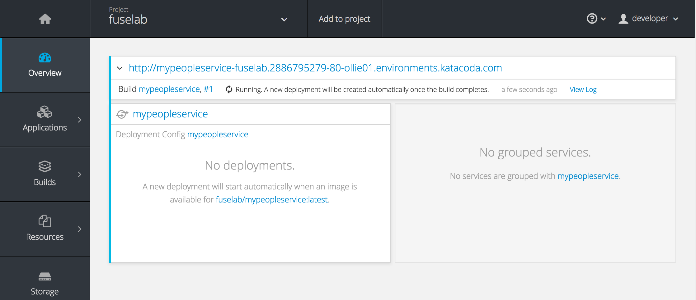

Inside the project, where is this case it should be an empty project, a prominent _Add to Project_ button will be displayed in the centre of the page.


This basic senario shows an example of a Fuse application running on OpenShift. It is defined in a template, which is constructed from a set of services, build configurations, and deployment configurations. This template references the source repositories to build and deploy the application.

Create the template by going back to console and excute following command:

`oc create -f fgstemplate.yml`{{execute}}

you will be prompted with output

```template "mypeopleservice-template" created```


After importing the template, create the application by running: 

`oc new-app mypeopleservice-template`{{execute}}

you should have similar output: 

```
--> Deploying template "fislab/mypeopleservice-template" to project fislab

     mypeopleservice-template
     ---------
     Katacode || FUSE || Getting started


     * With parameters:
        * Application Name=mypeopleservice
        * Git Repository URL=https://github.com/weimeilin79/katacoda-fuse-getting-started.git
        * CONTEXT_DIR=
        * Git Reference=master
        * Builder version=2.0
        * Application Version=1.0.0
        * Maven Arguments=package -DskipTests -Dfabric8.skip -e -B
        * Extra Maven Arguments=
        * Maven build directory=
        * Image Stream Namespace=openshift
        * Git Build Secret=6n3kxwUfa8Y37EMQNwH7c3e6S7VDXrLq2DvSMjeX # generated

--> Creating resources ...
    service "mypeopleservice" created
    imagestream "mypeopleservice" created
    buildconfig "mypeopleservice" created
    deploymentconfig "mypeopleservice" created
--> Success
    Use 'oc start-build mypeopleservice' to start a build.
    Run 'oc status' to view your app.
```

This senario builds the application by downloading your code, compile and build the application on OpenShift. Kick start and build application by running : 

`oc start-build mypeopleservice`{{execute}}

you should see similar output: 

```build "mypeopleservice-1" started```


Go back to the console and reload/refresh the page. Returned to the _Overview_ page, where you can view the details of the application created and monitor progress as it is built and deployed.




