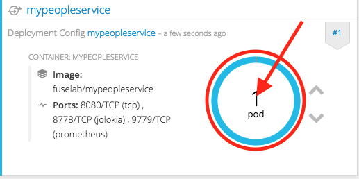
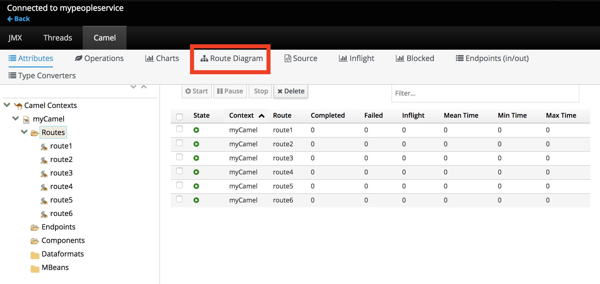
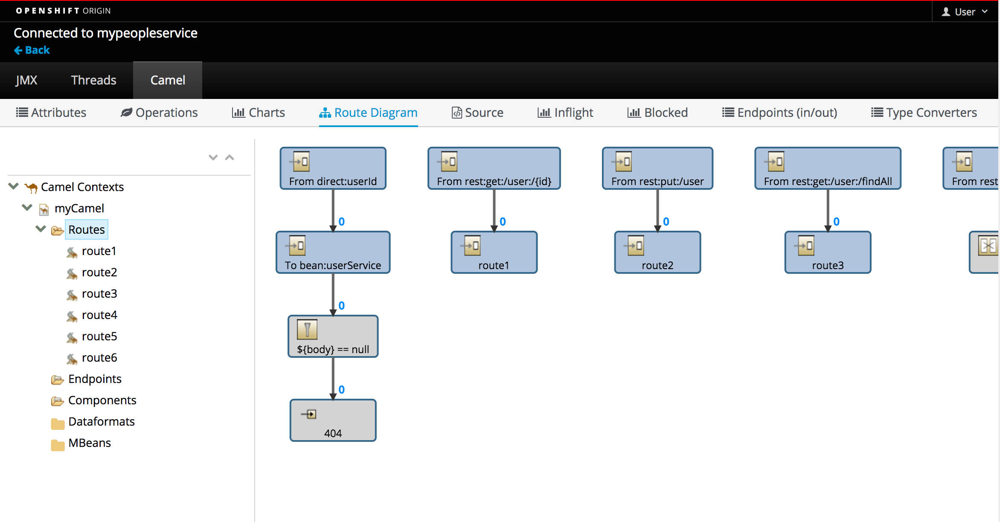
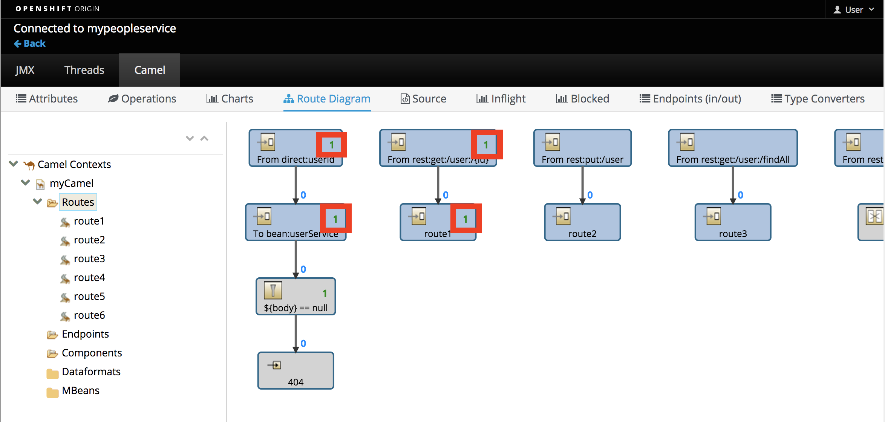
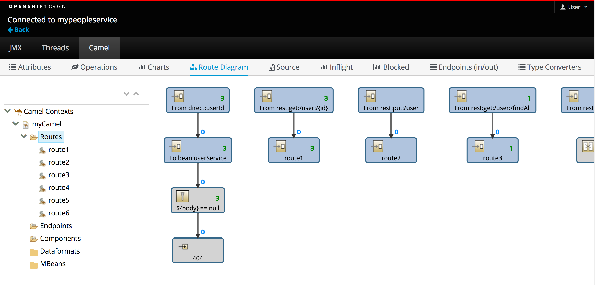

In this next section of the scenario we will use the JBoss FIS 2.0 Hawtio Console to test and review the behavior of our new route.  

### What is Hawtio? 
The JBoss Fuse Hawtio console provides in depth details into the Camel and ActiveMQ components deployed as part of a JBoss FIS 2.0 application. This includes standard JVM resources such as memeory and threads as well as JMX attributes and operations. The Hawtio console also provides a full selection of tools used to drill into the JBoss FIS 2.0 Camel and ActiveMQ components.

To get there we start with selecting the Applications menu on the left and then select Pods.



You will be taken directly to the pod detail page. Below the *Template* section on the page you will find a link named "Open Java Console". Go ahead and click it


You are now taken to the JBoss Fuse Hawtio console. Continue on to see how we can get better insight into the People Service API through this console deployed with all JBoss FIS 2.0 applications.

Lets get started by taking a look at some statistics provided by the console.  Select the "Route Diagram" to see more detail implementation:



The Route Diagram tab provids a graphical review of all the routes currently deployed in our API application.  After selecting this tab we should see something similar to what is pictured below; 5 routes starting with various Enterprise Integration Patterns, or EIPs, representation of route behavior:




Now lets take a look at calling the APIs and tracing that output on the Hawtio console.

To highlight these capabilities the People Service API has 3 methods provided with it. They are:

- Retrieve User
- Create User  
- Retrieve All Users

> Note: To see the Camel REST APIs defined, check it out [here](https://github.com/jbossdemocentral/katacoda-fuse-getting-started/blob/master/src/main/resources/spring/camel-context.xml)

Switch back over to the _Terminal_ screen and let's try retrieving user information by running:

``curl http://mypeopleservice-fuselab.[[HOST_SUBDOMAIN]]-80-[[KATACODA_HOST]].environments.katacoda.com/people-service/user/123``{{execute}}

This will display output similar to:

```
{
  "id" : 123,
  "name" : "John Doe"
}
```
Go back to the _Dashboard view_, in the **Hawtio console**, you should be able to see the number of message pass through route "get user" has been updated to "1":

_If the numbers do not update at first, click over to the Source or Inflight tab and then back to the Route Diagram screen..._ I NEVER GET THE NUMBERS TO UPDATE, EVEN AFTER CURL'ING FOR DONALD DUCK




Lets make some more calls to our User API service.  Switch back over to the _Terminal_ screen and and run each of the following :

``curl http://mypeopleservice-fuselab.[[HOST_SUBDOMAIN]]-80-[[KATACODA_HOST]].environments.katacoda.com/people-service/user/456``{{execute}}

This will display output similar to:

```
{
  "id" : 456,
  "name" : "Donald Duck"
}
```

``curl http://mypeopleservice-fuselab.[[HOST_SUBDOMAIN]]-80-[[KATACODA_HOST]].environments.katacoda.com/people-service/user/789``{{execute}}

This will display output similar to:

```
{
  "id" : 789,
  "name" : "Slow Turtle"
}
```

To retrieve entire user list, try running :

``curl http://mypeopleservice-fuselab.[[HOST_SUBDOMAIN]]-80-[[KATACODA_HOST]].environments.katacoda.com/people-service/user/findall``{{execute}}

This will display output similar to:

```
[ {
  "id" : 123,
  "name" : "John Doe"
}, {
  "id" : 456,
  "name" : "Donald Duck"
}, {
  "id" : 789,
  "name" : "Slow Turtle"
} ]
```

Back to _Dashboard view_, in the **Hawtio console**, numbers of API calls are also refected on the diagram:



And lastly, try adding another user to the list.  Switch back over to the _Terminal_ screen and run :

``curl -H "Content-Type: application/json" -X PUT -d '{"id":888, "name" : "Christina"}' http://mypeopleservice-fuselab.[[HOST_SUBDOMAIN]]-80-[[KATACODA_HOST]].environments.katacoda.com/people-service/user``{{execute}}

This will display output similar to:

```
{
  "id" : 888,
  "name" : "Christina"
}
```
Over in the _Dashboard_ browser our _Route Diagram_ should have even more updates as shown below :


Now lets see how the User Service API is documented by clicking the _Continue_ button.
