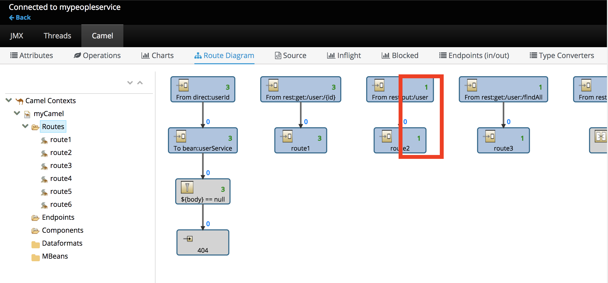

Now lets take a look at calling our APIs and tracing that output on the Hawtio console.

We have there are three APIs avalible for us to call.  They are:

- Retrieve User
- Create User  
- Retrieve All Users

Let's try retrieving user information by running:

``curl http://mypeopleservice-fuselab.[[HOST_SUBDOMAIN]]-80-[[KATACODA_HOST]].environments.katacoda.com/people-service/user/123``{{execute}}

This will display output similar to:

```
{
  "id" : 123,
  "name" : "John Doe"
}
```
Go back to the _Dashboard view_, in the **Hawtio console**, you should be able to see the number of message pass through route "get user" has been updated to "1":

_If the numbers do not update at first, select <- Back in the upper left hand corner and then go back into the Java Console..._


Try getting more user data

``curl http://mypeopleservice-fuselab.[[HOST_SUBDOMAIN]]-80-[[KATACODA_HOST]].environments.katacoda.com/people-service/user/456``{{execute}}

This will display output similar to:

```
{
  "id" : 456,
  "name" : "Donald Duck"
}
```

``curl http://mypeopleservice-fuselab.[[HOST_SUBDOMAIN]]-80-[[KATACODA_HOST]].environments.katacoda.com/people-service/user/789``{{execute}}

This will display output similar to:

```
{
  "id" : 789,
  "name" : "Slow Turtle"
}
```

To retrieve entire user list, try running :

``curl http://mypeopleservice-fuselab.[[HOST_SUBDOMAIN]]-80-[[KATACODA_HOST]].environments.katacoda.com/people-service/user/findall``{{execute}}

This will display output similar to:

```
[ {
  "id" : 123,
  "name" : "John Doe"
}, {
  "id" : 456,
  "name" : "Donald Duck"
}, {
  "id" : 789,
  "name" : "Slow Turtle"
} ]
```

Back to _Dashboard view_, in the **Hawtio console**, numbers of API calls are also refected on the diagram:


And lastly, try adding more user to the list:

``curl -H "Content-Type: application/json" -X PUT -d '{"id":888, "name" : "Christina"}' http://mypeopleservice-fuselab.[[HOST_SUBDOMAIN]]-80-[[KATACODA_HOST]].environments.katacoda.com/people-service/user``{{execute}}

This will display output similar to:

```
{
  "id" : 888,
  "name" : "Christina"
}
```

