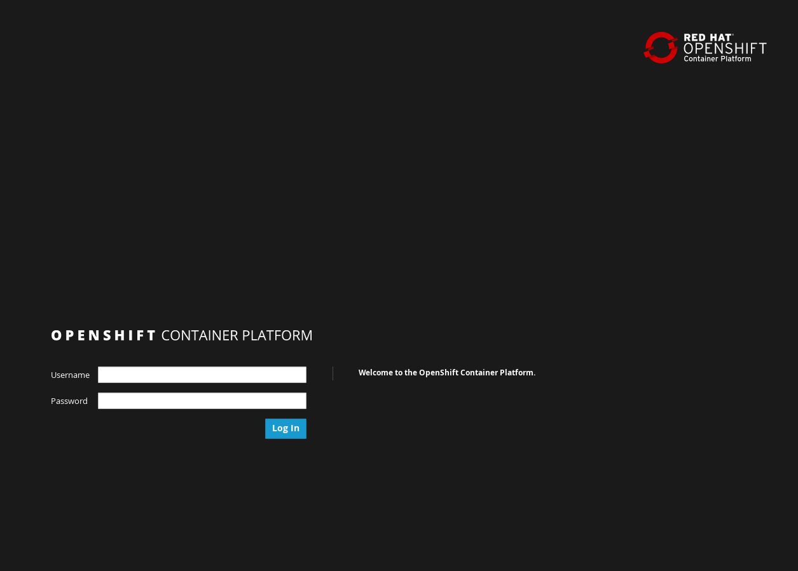

While the command line tool is awesome, for this course we are going to focus on the web console which is equally awesome..

## Task 1
To begin, click on the **Dashboard** tab in the console frame of this browser window. This will open the web console link in another tab or window of your browser.

You should see an **OpenShift Origin** window with **Username** and **Password** forms, similar to this one:

For this scenario, start by entering the following:

**Username:** `developer`

**Password:** `developer`

After logging in to the web console, you'll see a button labeled: **New Project**. Click this to get started.

You should now see a page for creating your first project in web console. Fill it in with the following:
>New project

>** *Name **

>`myproject`

The rest is optional and up to you. Be careful with all of that responsibility.

After your project is created, you'll be taken to a screen where you can begin adding content to your project.

## Task 2

The breadcrumb at the top says **Add to Project** next to the name of your project, in this case **myproject**. We'll be using that in the next task. For now, just click on the link for *myproject* which will bring you back to the overview.

Notice the menu on the left. You're now currently on the **Overview** screen. The tools that you'll need for building and deploying your application can also be found here on the left, as well as setting access controls.

Take a quick look around these, clicking on **Applications >**, **Builds >**, and **Resources >** to see more options. There won't be much there for now as we have nothing in our project.

We'll get into those in future sections, but go ahead and explore to see what's possible! Don't spend too much time on that now as you will get to use a lot of those in the upcoming sections.
