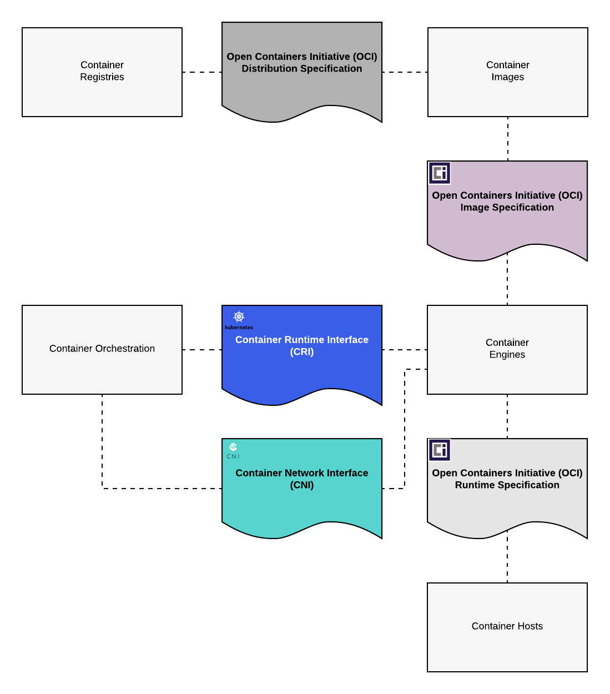
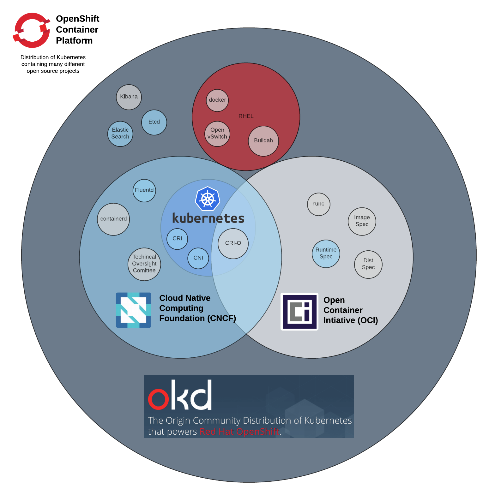

At the most basic level, the [Container Engine](https://developers.redhat.com/blog/2018/02/22/container-terminology-practical-introduction/#h.6yt1ex5wfo3l) and kernel work together to build and run [Containers](https://developers.redhat.com/blog/2018/02/22/container-terminology-practical-introduction/#h.j2uq93kgxe0e). Now, let's take a look at some of the standards that govern these interactions. Similar to the fact that containers don't run on docker, they aren't really "docker containers" either. All of the major container engines (docker, CRI-O, containerd, podman, and others) comply with the [Open Containers Initiative (OCI)](https://www.opencontainers.org/) standards. They should actually be called OCI containers or Linux Containers: 

There are five main governing standards that should be understood in this section:

1. **OCI Image Specification** - governs the on-disk [format](https://developers.redhat.com/blog/2018/02/22/container-terminology-practical-introduction/#h.dgn6r69i32gs) of [Container Images](https://developers.redhat.com/blog/2018/02/22/container-terminology-practical-introduction/#h.dqlu6589ootw). Essentially a group of tar files and some metadata in a json file.
2. **OCI Distribution Specification** - governs the interaction of any tool which communicates with a registry server. Typically this is a container engine, but can also be dedicated tools like [Skopeo](https://github.com/containers/skopeo).
3. **OCI Runtime Specification** - governs the communication between the container engine and the Linux kernel (or Windows). The OCI is also the home for the reference implementation of this code, called [runc](https://github.com/opencontainers/runc). Every major container engine mentioned above uses runc, so they basically all create the same kind of containers.

These three basic standards govern the underlying building blocks of containers, but to run them in production at scale requires another layer called [Container Orchestration](https://developers.redhat.com/blog/2018/02/22/container-terminology-practical-introduction/#h.6yt1ex5wfo66). Kubernetes is the most popular container orchestration software and that's what will be focused on in this lab. The following two standards enable modularity at the container orchestration layer within Kubernetes:

4. **Container Runtime Interface (CRI)** - governs the interaction between Kubernetes and container engines. This enables users to select any CRI compliant container engine they choose within Kubernetes.
5. **Container Network Interface (CNI)** - governs the interaction between the container engine and dedicated network plugins. The Kubelet can also interface directly with CNI. This enables complex network architectures using simple plugins.

The OCI standards are governed under the Linux Foundation, while CRI and CRI are governed by the Kubernetes community. Linux distributions like Fedora, RHEL, Debian, and Ubuntu are made up of a Linux kernel and a bunch of supporting software to provide a working, integrated system. Kubernetes also has distributions like OKD and OpenShift Container Platform which pull together Kubernetes (like the kernel) and a bunch of supporting software like a [Container Registry](https://developers.redhat.com/blog/2018/02/22/container-terminology-practical-introduction/#h.4cxnedx7tmvq), a [Container Engine](https://developers.redhat.com/blog/2018/02/22/container-terminology-practical-introduction/#h.6yt1ex5wfo3l), a [Container Host](https://developers.redhat.com/blog/2018/02/22/container-terminology-practical-introduction/#h.8tyd9p17othl), [Operators](https://coreos.com/operators/), certified [Container Images](https://developers.redhat.com/blog/2018/02/22/container-terminology-practical-introduction/#h.dqlu6589ootw), and a host of other supporting software like [Open Service Broker](https://kubernetes.io/docs/concepts/extend-kubernetes/service-catalog/) integration, [Istio](https://istio.io/), [Prometheus](https://prometheus.io/) and others. Together all of these programs become a useable distribution of Kubernetes, much like a Linux distribution. In the case of OpenShift, it looks similar to this:

As a final lesson, take a look at the all of the processes running on our test system. Notice the parent-child relationship between all of the daemons. Also, note that the OpenShift API, Controller and Node processes can actually be run as normal processes or docker containers. There are a tremendous amount of daemons, processes, and libraries working together to provide a functional container platform: 

``ps aux --forest``{{execute}}

Looking at this all working together, it's important to realize that this entire toolchain is open source, but different components are driven by different communities. Red Hat leads in all of these communities and brings all of these pieces together with OpenShift. Each of these standards will be covered deeper in a later lab, but for now, understand that "containers don't run on docker' and they're not "docker containers" - they're OCI governed containers. And, to run containers in a cloud-native world, you need a contianer platform which utilizes container orchestration like Kubernetes.
