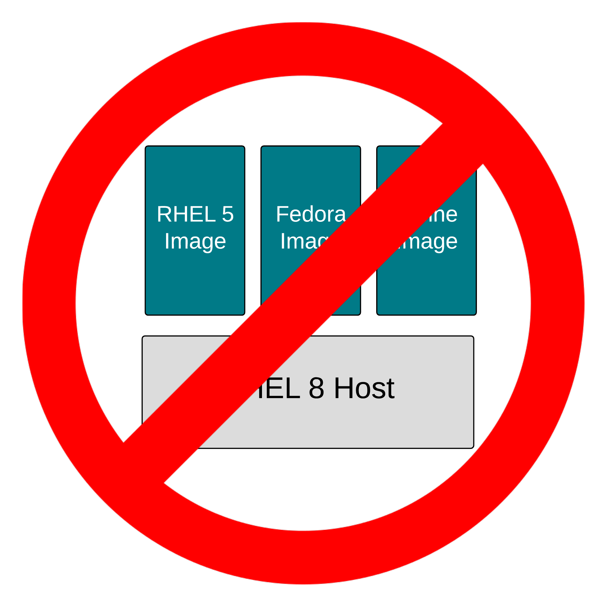

Container images are really just tar files. Seriously, they are tar files, and an associated json file. Together we call these an Image Bundle and the on-disk format is defined by the [OCI Image Specification|https://github.com/opencontainers/image-spec]. All major container engines including Podman, Docker, RKT, CRI-O and containerd consume them.

But let's dig into three concepts a little deeper:

Portability - since the OCI standard governs the images specification, a container image can be created with Podman, pushed to almost any container registry to be shared with the world, and pulled down with almost any container engine in the world including Docker, RKT, CRI-O, containerd, and of course Podman. Standardizing on this image format let's us build infrastructure like registry servers which can be used for any container images be them RHEL 6, RHEL 7, RHEL8, Fedora, or even Windows container images.

`podman pull fedora`{{execute}}

Compatibility - this addressses the content inside the container image. No matter how hard you try, ARM binaries in a container image will not run on POWER container hosts. Containers do not offer compatability guarantees, only virtualization can offer that. This compatibility problem extends to processor architecture, and also versions of the operating system. Try running RHEL 8 binaries in a container image on RHEL 4 container hosts. That isn't going to work.

`podman run -t fedora cat /etc/redhat-release`{{execute Terminal}}

Supportability: is what vendors choose to support. This is about investing in testing, security, performance, and architecture of the way binaries are compiled. For example, in RHEL 8, Red Hat Supports RHEL 6, UBI 7, and UBI 8 container images on both RHEL 7 and RHEL 8 based (including CoreOS) container hosts.

`podman run -t rhel7 cat /etc/redhat-release`{{execute Terminal}}

Analyzing portability, compatibility, and supportability, we can deduce that a RHEL 7 image will work on RHEL 7 host perfectly. The code in both were designed, compiled, and tested together. The Product Security Team at Red Hat is analyzing CVEs for this combination, performance teams are testing RHEL 7 web servers, with a RHEL 7 kernel, etc, etc.

But, we can't guarantee that RHEL 5, Fedora, and Alpine images will work like they were built to on a RHEL 7 host. The images will be able to be pulled down and cached locally, the container engine will be able to digest them, but we can't guarantee that the binaries in the container images will work correctly. We can't guarantee that there won't be strange CVEs that show up because of the version combinations, and we can't guarantee the performance of the binaries running on a kernel for which it wasn't compiled. That said, many times, these binaries will appear to just work.

This leads us to supportability as a concept seperate from portability and compatibility. This is the ability to guarantee to some level that these images will work on these hosts. Red Hat can do this between some major versions of RHEL for the same reason that we can do it with the [RHEL Application Compatability Guide|https://access.redhat.com/articles/rhel-abi-compatibility]. We take care to compile our programs in a way that doesn't break compatibility, we analyze CVEs, we test performance. A bare minimum of testing, security, and performance can go a long way in ensureing supportability between versions of Linux, but there are limits. One should not expect that container images from RHEL 9, 10, or 11 will run on RHEL 8 hosts.

Alright, now that we have sorted out the basics of container images, let's move on the registries...
