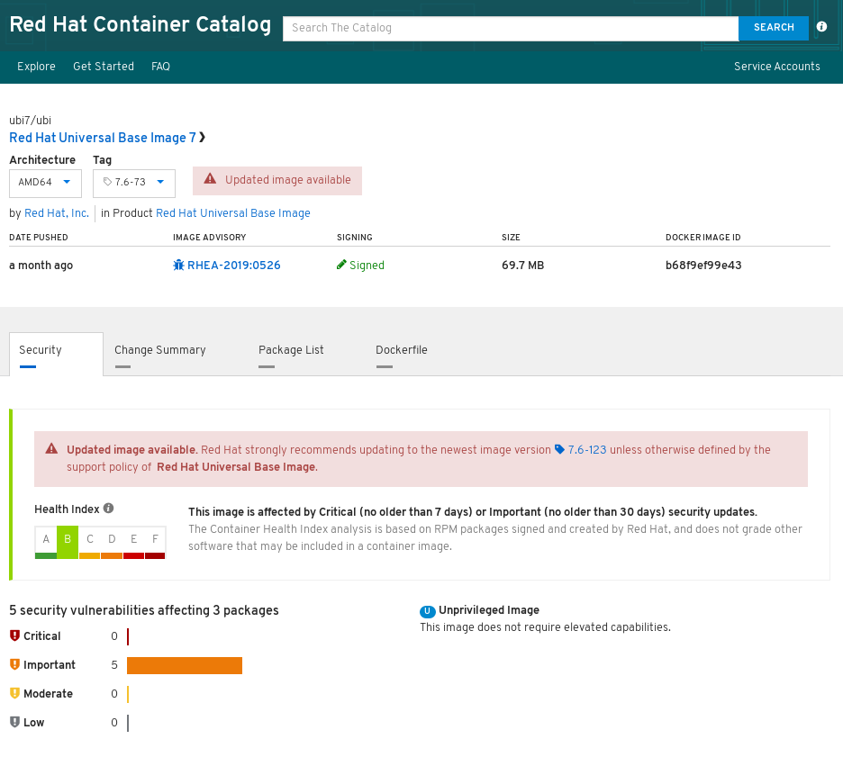

The goal of this exercise is to learn how to evaluate a [Container Image](https://developers.redhat.com/blog/2018/02/22/container-terminology-practical-introduction/#h.dqlu6589ootw) and the [Registry Server](https://developers.redhat.com/blog/2018/02/22/container-terminology-practical-introduction/#h.4cxnedx7tmvq) from which you get it. 

First, lets start what we already know, there is often a full functioning Linux distro inside a container image. That's because it's useful to leverage existing packages and the dependency tree already created for it. This is true whether running on bare metal, in a virtual machine, or in a container image. It's also important to consider the quality, frequency, and ease of consuming updates in the container image.

To analyze the quality, we are going to leverage existing tools - which is another advantage of consuming a container image which leverages a Linux distro. To demonstrate, let's examine images from four different Linux distros - CentOS, Fedora, Ubuntu, and Red Hat Enterprise Linux. Each will have diffing levels of information:

### CentOS
``docker run -it centos:7.0.1406 yum updateinfo``{{execute}}

CentOS does not provide Errata for package updates, so this command will not show any information. This makes it difficult to map CVEs to RPM packages, and only update the ones you need. This also makes it difficult to score a container image for quality unless it is completely updated.

### Fedora
``docker run -it fedora dnf updateinfo``{{execute}}

Fedora provides decent meta data about what packages need updated, but does not map them to CVEs either. Results will vary on any given day, but the output will often look something like this:

```
Last metadata expiration check: 0:00:07 ago on Mon Oct  8 16:22:46 2018.
Updates Information Summary: available
    5 Security notice(s)
        1 Moderate Security notice(s)
        2 Low Security notice(s)
    5 Bugfix notice(s)
    2 Enhancement notice(s)
```

### Ubuntu
``docker run -it ubuntu:trusty-20170330 /bin/bash -c "apt-get update && apt list --upgradable"``{{execute}}

Ubuntu provides information at a similar quality to Fedora, but again does not map updates to CVEs easily. The results for this specific image should always be the same because we are purposefully pulling an old tag.

### Red Hat Enterprise Linux
``docker run -it registry.access.redhat.com/rhel7:7.4-105 yum updateinfo security``{{execute}}

Regretfully, we do not have subscriptions to analyze the Red Hat image on the command line, but the output should look like the following:

```
RHSA-2017:3263 Moderate/Sec.  curl-7.29.0-42.el7_4.1.x86_64
RHSA-2018:0805 Moderate/Sec.  glibc-2.17-222.el7.x86_64
RHSA-2018:0805 Moderate/Sec.  glibc-common-2.17-222.el7.x86_64
RHSA-2018:2181 Important/Sec. gnupg2-2.0.22-5.el7_5.x86_64
RHSA-2018:0666 Moderate/Sec.  krb5-libs-1.15.1-18.el7.x86_64
RHSA-2017:3263 Moderate/Sec.  libcurl-7.29.0-42.el7_4.1.x86_64
RHSA-2018:0849 Low/Sec.       libgcc-4.8.5-28.el7.x86_64
RHSA-2018:0849 Low/Sec.       libstdc++-4.8.5-28.el7.x86_64
RHSA-2017:2832 Important/Sec. nss-3.28.4-12.el7_4.x86_64
RHSA-2018:2768 Moderate/Sec.  nss-3.36.0-7.el7_5.x86_64
RHSA-2017:2832 Important/Sec. nss-sysinit-3.28.4-12.el7_4.x86_64
RHSA-2018:2768 Moderate/Sec.  nss-sysinit-3.36.0-7.el7_5.x86_64
RHSA-2017:2832 Important/Sec. nss-tools-3.28.4-12.el7_4.x86_64
RHSA-2018:2768 Moderate/Sec.  nss-tools-3.36.0-7.el7_5.x86_64
RHSA-2018:0998 Moderate/Sec.  openssl-libs-1:1.0.2k-12.el7.x86_64
RHSA-2018:1700 Important/Sec. procps-ng-3.3.10-17.el7_5.2.x86_64
RHSA-2018:2123 Moderate/Sec.  python-2.7.5-69.el7_5.x86_64
RHSA-2018:2123 Moderate/Sec.  python-libs-2.7.5-69.el7_5.x86_64
RHSA-2018:0260 Moderate/Sec.  systemd-219-42.el7_4.7.x86_64
RHSA-2018:0260 Moderate/Sec.  systemd-libs-219-42.el7_4.7.x86_64
RHSA-2018:2285 Important/Sec. yum-plugin-ovl-1.1.31-46.el7_5.noarch
RHSA-2018:2285 Important/Sec. yum-utils-1.1.31-46.el7_5.noarch
```
Even without a subscription, we can analyze the quality of a Red Hat image by looking at the Red Hat Container Cataog

``Click: [Red Hat Enterprise Linux 7.4-105 Base Image](https://access.redhat.com/containers/#/registry.access.redhat.com/rhel7/images/7.4-105)``

We should see something similar to




Now, that we have taken a look at several container images, we are going to start to look at where they came from and how they were built - we are going to evaluate regsitry servers.

## 
- [registry.fedoraproject.org](https://registry.fedoraproject.org/)

Poke around in the Red Hat Container Catalog and notice how this particulare image has a warning associated. That's because container images age like cheese, not like wine. Trust is termporal and older container images age just like servers which are rarely or never patched. 

Now take a look at the Container Health Index scoring for each tag that is available: 

[Red Hat Enterprise Linux Base Image - All Tags](https://access.redhat.com/containers/?tab=tags#/registry.access.redhat.com/rhel7)

Notice, that the newer the tag, the better the letter grade. The Red Hat Container Catalog and Container Health Index clearly show you that the newer images have a less vulnerabiliites and hence have a better letter grade. To fully understand the scoring criteria, check out [Knowledge Base Article](https://access.redhat.com/articles/2803031).

Finally, let's do the same test we did before, but on a newer container image:

``docker run -it registry.access.redhat.com/rhel7:7.4-105 yum updateinfo security``{{execute}}

Notice that there are no available errata. Now, let's take a look at a couple of other registries:


- [https://hub.docker.com/explore/](https://hub.docker.com/explore/)
- [https://bitnami.com/containers](https://bitnami.com/containers)

Knowing what you know now:
- How would you rate your trust in these registries? By brand, tooling, image quality?
- How would you analyze these container images to determine if you trust them? 
- How would you rate the tooling they provide you to analyze images?

These questions seem easy, but their really not. It really makes you revisit what it means to "trust" a acontainer image...
