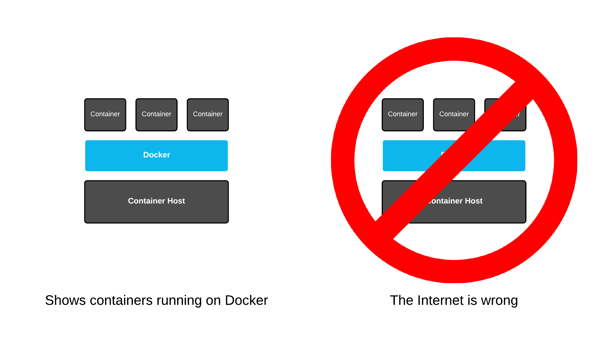
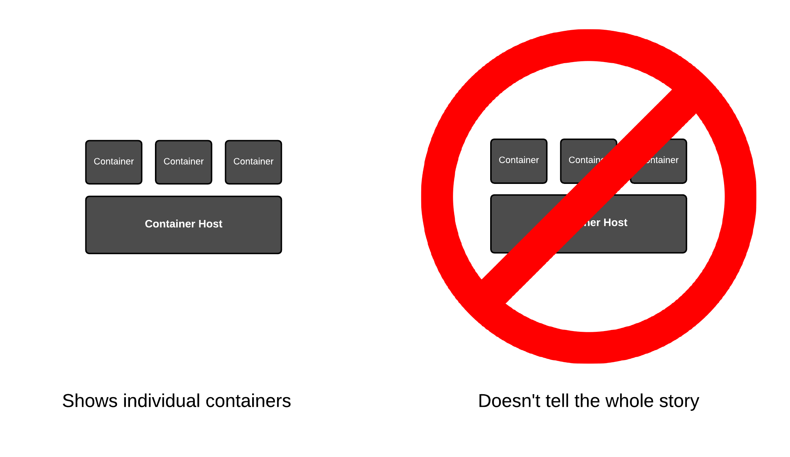
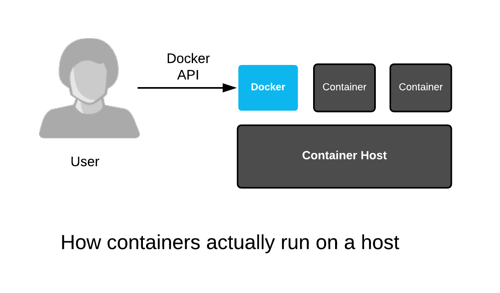
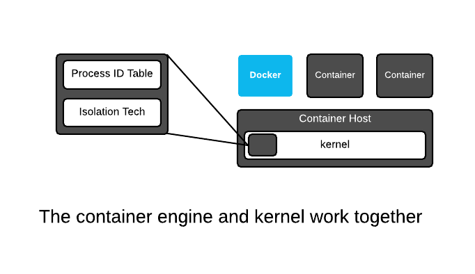

If you just do a quick Google search, you will find tons of architectural drawings which depict things the wrong way or only tell part of the story. This leads the innocent viewer to come to the wrong conclusion about containers. One might suspect that even the makers of these drawings have the wrong conclusion about how containers work and hence propogate bad information. So, forget everything you think you know.

How do people get it wrong? In two main ways:
 
First, most of the architectural drawings above show the docker daemon as a wide blue box stretched out over the [Container Host](https://developers.redhat.com/blog/2018/02/22/container-terminology-practical-introduction/#h.8tyd9p17othl). The [Containers](https://developers.redhat.com/blog/2018/02/22/container-terminology-practical-introduction/#h.j2uq93kgxe0e) are shown as if they are running on top of the docker daemon. This is incorrect - [containers don't run on docker](http://crunchtools.com/containers-dont-run-on-docker/). The docker engine is an example of a general purpose [Container Engine](https://developers.redhat.com/blog/2018/02/22/container-terminology-practical-introduction/#h.6yt1ex5wfo3l). Humans talk to container engines and container engines talk to the kernel - the containers are actually created and run by the Linux kernel. Even when drawings do actually show the right architecture between the container engine and the kernel, they never show containers running side by side:

Second, when drawings show containers are Linux processes, they never show the container engine side by side. This leads people to never think about these two things together, hence users are left confused with only part of the story:

 
For this lab, let’s start from scratch. In the terminal, let's start with a simple experiment - start three containers which will all run the top command:

`docker run -td registry.access.redhat.com/ubi7/ubi top`{{execute}}

`docker run -td registry.access.redhat.com/ubi7/ubi top`{{execute}}

`podman run -td registry.access.redhat.com/ubi7/ubi top`{{execute}}

Now, let's inspect the process table of the underlying host:

`ps -efZ | grep top`{{execute}}

Notice that even though we started each of the ``top`` commands in containers, they are still just a regular process which can be viewed with the trusty old ``ps`` command. That's because containerized processes are just [fancy Linux processes](http://sdtimes.com/guest-view-containers-really-just-fancy-files-fancy-processes/) with extra isolation from normal Linux processes. Hack around a bit, and notice that the docker daemon runs side by side with the containerized processes. A simplified drawing should really look something like this:

 

In the kernel, there is no single data structure which represents what a container is. This has been debated back and forth for years - some people think there should be, others think there shouldn't. The current Linux kernel community philosophy is that the Linux kernel should provide a bunch of different technologies, ranging from experimental to very mature, enabling users to mix these technologies together in creative, new ways. And, that's exactly what a container engine (Docker, Podman, CRI-O) does - it leverages kernel technologies to create, what we humans call containers. The concept of a container is a user construct, not a kernel construct. This is a common pattern in Linux and Unix - this split between lower level (kernel) and higher level (userspace) technologies allows kernel developers to focus on enabling technologies, while users experiment with them and find out what works well.

 
The Linux kernel only has a single major data structure that tracks processes - the process id table. The '''ps''' command dumps the contents of this data structure. But, this is not the total definition of a container - the container engine tracks which kernel isolation technologies are used, and even what data volumes are mounted. This information can be thought of as metadata which provides a definition for what we humans call a container. We will dig deeper into the technical underpinnings, but for now, understand that containerized processes are regular Linux processes which are futher isolated using kernel technologies like namesspaces, selinux and cgroups. This is sometimes described as "sand boxing" or "isolation" or an "illusion" of virtualization.

In the end though, containerized processes are just regular Linux processes. All processes live side by side, whether they are regular Linux processes, long lived daemons, batch jobs, interactive commands which you run manually, or containerized processes. All of these processe make requests to the Linux kernel for protected resources like memory, RAM, TCP sockets, etc. We will explore this deeper in later labs, but for now, commit this to memory...
